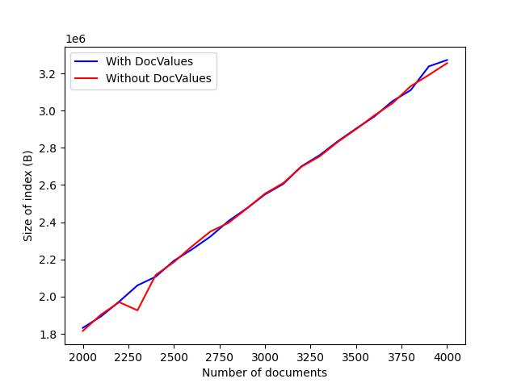
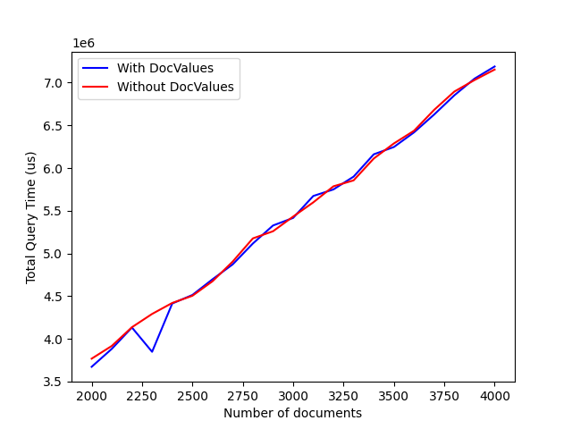

<h2>Purpose of Docvalues</h2>

<h3>Background</h3>

What are docValues? In the index mapping, there is an option to enable or disable docValues for a specific field mapping. However, what does it actually mean to activate or deactivate docValues, and how does it impact the end user? This document aims to address these questions.

<pre>
	"default_mapping": {
		"dynamic": true,
		"enabled": true,
		"properties": {
			"loremIpsum": {
			"enabled": true,
			"dynamic": false,
			"fields": [
				{
					"name": "loremIpsum",
					"type": "text",
					"store": false,
					"index": true,
					"include_term_vectors": false,
					"include_in_all": false,
					"docvalues": true
				}
			]
		}
	}
</pre>

Enabling docValues will always result in an increase in the size of your Bleve index, leading to a corresponding increase in disk usage. But what advantages can you expect in return? This document also quantitatively assesses this trade-off with a test case.

In a more general sense, we recommend enabling docValues on a field mapping if you anticipate queries that involve sorting and/or facet operations on that field. It's important to note, though, that sorting and faceting will work irrespective of whether docValues are enabled or not. This may lead you to wonder if there's any real benefit to enabling docValues since you're allocating extra disk space without an apparent return. The real advantage, however, becomes evident in enhanced query response times and reduced memory consumption during active usage. By accepting a minor increase in the disk space used by your Full-Text Search (FTS) index, you can anticipate better performance in handling search requests that involve sorting and faceting.

<h3>Usage</h3>

The initial use of docValues comes into play when sorting is involved. In the search request JSON, there is a field named "sort." This optional "sort" field can have a slice of JSON objects as its value. Each JSON object must belong to one of the following types: 
	<ul>
		<li>SortDocID</li>
		<li>SortScore (which is the default if none is specified)</li>
		<li>SortGeoDistance</li> 
		<li>SortField</li>
	</ul>

DocValues are relevant only when any of the JSON objects in the "sort" field are of type SortGeoDistance or SortField. This means that if you expect queries on a field F, where the queries either do not specify a value for the "sort" field or provide a JSON object of type SortDocID or SortScore, enabling docValues will not improve sorting operations, and as a result, query latency will remain unchanged. It's worth noting that the default sorting object, SortScore, does not require docValues to be enabled for any of the field mappings. Therefore, a search request without a sorting operation will not utilize docValues at all.

<table>
	<tr>
		<th>No Sort Objects</th>
		<th>SortDocID</th>
		<th>SortScore</th>
		<th>SortField</th>
		<th>SortGeoDistance</th>
	</tr>
	<tr>
		<td style="vertical-align: top; width: 20%;">
			<pre>
{
  "explain": true,
  "fields": [
    "*"
  ],
  "highlight": {},
  "query": {
    "match": "lorem ipsum",
    "field":"dolor"
  },
  "size": 10,
  "from": 0
}
			</pre>
		</td>
		<td style="vertical-align: top; width: 20%;">
			<pre>
{
  "explain": true,
  "fields": [
    "*"
  ],
  "highlight": {},
  "query": {
    "match": "lorem ipsum",
    "field":"sit_amet"
  },
  "sort":[
    {
     "by":"id",
     "desc":true
    }
    ],
  "size": 10,
  "from": 0
}
			</pre>
		</td>
		<td style="vertical-align: top; width: 20%;">
			<pre>
{
  "explain": true,
  "fields": [
    "*"
  ],
  "highlight": {},
  "query": {
    "match": "lorem ipsum",
    "field":"sit_amet"
  },
  "sort":[
    {
     "by":"score",
    }
    ],
  "size": 10,
  "from": 0
}
			</pre>
		</td>
		<td style="vertical-align: top; width: 20%;">
			<pre>
{
  "explain": true,
  "fields": [
    "*"
  ],
  "highlight": {},
  "query": {
    "match": "lorem ipsum",
    "field":"sit_amet"
  },
  "sort":[
    {
     "by":"field",
     "field":"dolor",
     "type":"auto",
     "mode":"min",
     "missing":"last"
    }
    ],
  "size": 10,
  "from": 0
}
			</pre>
		</td>
		<td style="vertical-align: top; width: 20%;">
			<pre>
{
  "explain": true,
  "fields": [
    "*"
  ],
  "highlight": {},
  "query": {
    "match": "lorem ipsum",
    "field": "dolor"
  },
  "sort": [
    {
      "by": "geo_distance",
      "field": "sit_amet",
      "location": [
        123.223,
        34.33
      ],
      "unit": "km"
    }
  ],
  "size": 10,
  "from": 0
}
			</pre>
		</td>
	</tr>
	<tr align="center">
		<td>No DocValues used</td>
		<td>No DocValues used</td>
		<td>No DocValues used</td>
		<td>DocValues used for field "dolor". Field Mapping for "dolor" may enable docValues.</td>
		<td>DocValues used, for field "sit_amet". 
Field Mapping for "sit_amet" may enable docValues.</td>
	</tr>
</table>

Now, let's consider faceting. The search request object also includes another field called "facets," where you can specify a collection of facet requests, with each request being associated with a unique name. Each of these facet requests can fall into one of three types:
<ul>
	<li>Date range</li> 
	<li>Numeric range</li>
	<li>Term facet</li> 
</ul>
Enabling docValues for the fields associated with such facet requests might provide benefits in this context.

<table>
	<tr>
		<th>No Facet Request</th>
		<th>Date Range Facet</th>
		<th>Numeric Range Facet</th>
		<th>Term Facet</th>
	</tr>
	<tr>
		<td style="vertical-align: top; width: 20%;">
			<pre>
{
  "explain": true,
  "fields": [
    "*"
  ],
  "highlight": {},
  "query": {
    "match": "lorem ipsum",
    "field": "dolor"
  },
  "size": 10,
  "from": 0
}
			</pre>
		</td>
		<td style="vertical-align: top; width: 20%;">
			<pre>
{
  "explain": true,
  "fields": [
    "*"
  ],
  "highlight": {},
  "query": {
    "match": "lorem ipsum",
    "field": "sit_amet"
  },
  "facet": {
    "facetA": {
      "size": 1,
      "field": "dolor",
      "date_ranges": [
        {
          "name": "lorem",
          "start": "20/August/2001",
          "end": "22/August/2002",
          "datetime_parser": "custDT"
        }
      ]
    }
  },
  "size": 10,
  "from": 0
}
			</pre>
		</td>
		<td style="vertical-align: top; width: 20%;">
			<pre>
{
  "explain": true,
  "fields": [
    "*"
  ],
  "highlight": {},
  "query": {
    "match": "lorem ipsum",
    "field": "sit_amet"
  },
  "facet": {
    "facetA": {
      "size": 1,
      "field": "dolor",
      "numeric_ranges":[
          { 
            "name":"lorem",
            "min":22,
            "max":34
          }
        ]
    }
  },
  "size": 10,
  "from": 0
}
			</pre>
		</td>
		<td style="vertical-align: top; width: 20%;">
			<pre>
{
  "explain": true,
  "fields": [
    "*"
  ],
  "highlight": {},
  "query": {
    "match": "lorem ipsum",
    "field": "sit_amet"
  },
  "facet": {
    "facetA": {
      "size": 1,
      "field": "dolor"
    }
  },
  "size": 10,
  "from": 0
}
			</pre>
		</td>
	</tr>
	<tr align="center">
		<td>No DocValues used</td>
		<td colspan="3">DocValues used for field "dolor". Field Mapping for "dolor" may enable docValues.</td>	
  </tr>
</table>

In summary, when a search request is received by the Bleve index, it extracts all the fields from the sort objects and facet objects. To potentially benefit from docValues, you should consider enabling docValues for the fields mentioned in SortField and SortGeoDistance sort objects, as well as the fields associated with all the facet objects. By doing so, you can optimize sorting and faceting operations in your search queries.

<table>
	<tr>
		<th>Combo A</th>
		<th>Combo B</th>
	</tr>
	<tr>
		<td style="vertical-align: top; width: 20%;">
			<pre>
{
  "explain": true,
  "fields": [
    "*"
  ],
  "highlight": {},
  "query": {
    "match": "lorem ipsum",
    "field": "sit_amet"
  },
  "facet": {
    "facetA": {
      "size": 1,
      "field": "dolor",
      "date_ranges": [
        {
          "name": "lorem",
          "start": "20/August/2001",
          "end": "22/August/2002",
          "datetime_parser": "custDT"
        }
      ]
    }
  },
  "sort":[
    {
     "by":"field",
     "field":"lorem",
     "type":"auto",
     "mode":"min",
     "missing":"last"
    }
    ],
  "size": 10,
  "from": 0
}
			</pre>
		</td>
		<td style="vertical-align: top; width: 20%;">
			<pre>
{
  "explain": true,
  "fields": [
    "*"
  ],
  "highlight": {},
  "query": {
    "match": "lorem ipsum",
    "field": "sit_amet"
  },
  "facet": {
    "facetA": {
      "size": 1,
      "field": "dolor",
      "numeric_ranges":[
          { 
            "name":"lorem",
            "min":22,
            "max":34
          }
        ]
    }
  },
  "sort": [
    {
      "by": "geo_distance",
      "field": "ipsum",
      "location": [
        123.223,
        34.33
      ],
      "unit": "km"
    }
  ],
  "size": 10,
  "from": 0
}
			</pre>
		</td>
	</tr>
	<tr align="center">
		<td>DocValues used for field "dolor" and "lorem". Field Mapping for "dolor" and "lorem" may enable docValues.</td>
		<td>DocValues used for field "dolor" and "ipsum". Field Mapping for "dolor" and "ipsum" may enable docValues.</td>
	</tr>
</table>

<h3>Empirical Analysis</h3>

To evaluate our hypothesis, I've set up a sample dataset on my personal computer and I've created two Bleve indexes: one with docvalues enabled for three fields (<code>dummyDate</code>, <code>dummyNumber</code>, and <code>dummyTerm</code>), and another where I've disabled docValues for the same three fields. These field mappings were incorporated into the Default Mapping. It's important to mention that for both indexes, DocValues for dynamic fields were enabled, as the default mapping is dynamic.

The values for <code>dummyDate</code> and <code>dummyNumber</code> were configured to increase monotonically, with <code>dummyDate</code> representing a date value and `dummyNumber` representing a numeric value. This setup was intentional to ensure that facet aggregation would consistently result in cache hits and misses, providing a useful testing scenario.

<table>
	<tr>
		<th>Index A</th>
		<th>Index B</th>
	</tr>
	<tr>
		<td style="vertical-align: top; width: 20%;">
			<pre>
   "default_mapping": {
    "dynamic": true,
    "enabled": true,
    "properties": {
     "dummyNumber": {
      "enabled": true,
      "dynamic": false,
      "fields": [
       {
        "name": "dummyNumber",
        "type": "text",
        "store": false,
        "index": true,
        "include_term_vectors": false,
        "include_in_all": false,
        "docvalues": true
       }
      ]
     },
     "dummyTerm": {
      "enabled": true,
      "dynamic": false,
      "fields": [
       {
        "name": "dummyTerm",
        "type": "text",
        "store": false,
        "index": true,
        "include_term_vectors": false,
        "include_in_all": false,
        "docvalues": true
       }
      ]
     },
     "dummyDate": {
      "enabled": true,
      "dynamic": false,
      "fields": [
       {
        "name": "dummyDate",
        "type": "text",
        "store": false,
        "index": true,
        "include_term_vectors": false,
        "include_in_all": false,
        "docvalues": true
       }
      ]
     }
    }
   }
			</pre>
		</td>
		<td style="vertical-align: top; width: 20%;">
			<pre>
   "default_mapping": {
    "dynamic": true,
    "enabled": true,
    "properties": {
     "dummyNumber": {
      "enabled": true,
      "dynamic": false,
      "fields": [
       {
        "name": "dummyNumber",
        "type": "text",
        "store": false,
        "index": true,
        "include_term_vectors": false,
        "include_in_all": false,
        "docvalues": false
       }
      ]
     },
     "dummyTerm": {
      "enabled": true,
      "dynamic": false,
      "fields": [
       {
        "name": "dummyTerm",
        "type": "text",
        "store": false,
        "index": true,
        "include_term_vectors": false,
        "include_in_all": false,
        "docvalues": false
       }
      ]
     },
     "dummyDate": {
      "enabled": true,
      "dynamic": false,
      "fields": [
       {
        "name": "dummyDate",
        "type": "text",
        "store": false,
        "index": true,
        "include_term_vectors": false,
        "include_in_all": false,
        "docvalues": false
       }
      ]
     }
    }
   }
			</pre>
		</td>
	</tr>
	<tr align="center">
		<td>Docvalues enabled across all three field mappings</td>
		<td>Docvalues disabled across all three field mappings</td>
	</tr>
</table>

Document Format used for the test scenario:

<table>
	<tr>
		<th>Document 1</th>
		<th>Document 2</th>
		<th>... Document i</th>
		<th>Document 5000</th>
	</tr>
	<tr>
		<td style="vertical-align: top; width: 20%;">
			<pre>
{
	"dummyTerm":"Term",
	"dummyDate":"2000-01-01T00:00:00,
	"dummyNumber:1
}
			</pre>
		</td>
		<td style="vertical-align: top; width: 20%;">
			<pre>
{
	"dummyTerm":"Term",
	"dummyDate":"2000-01-01T01:00:00,
	"dummyNumber:2
}
			</pre>
		</td>
		<td style="vertical-align: top; width: 20%;">
			<pre>
{
	"dummyTerm":"Term",
	"dummyDate":"2000-01-01T01:00:00"+(i hours),
	"dummyNumber:i
}
			</pre>
		</td>
		<td style="vertical-align: top; width: 20%;">
			<pre>
{
	"dummyTerm":"Term",
	"dummyDate":2000-01-01T01:00:00 + (5000 hours),
	"dummyNumber:5000
}
			</pre>
		</td>
</table>

Now I ran the following set of search requests across both the indexes, while increasing the number of documents indexed from 2000 to 4000.

<table>
	<tr>
		<th>Request 1</th>
		<th>Request 2</th>
		<th>... Request i</th>
		<th>Request 1000</th>
	</tr>
	<tr>
		<td style="vertical-align: top; width: 20%;">
			<pre>
{
  "explain": true,
  "fields": [
    "*"
  ],
  "highlight": {},
  "query": {
    "match": "term",
    "field":"dummyTerm"
  },
  "facets":{
    "myDate":{
      "field":"dummyDate",
      "size":100000,
      "date_ranges":[
        {
          "start":"2000-01-01T00:00:00",
          "end":"2000-01-01T01:00:00"
        }
      ]
    },
    "myNum":{
      "field":"dummyNumber",
      "size":100000,
      "numeric_ranges":[
        {
          "min": 1000,
          "max": 1001
        }
      ]
    }
  },
  "size": 10,
  "from": 0
}
			</pre>
		</td>
		<td style="vertical-align: top; width: 20%;">
			<pre>
{
  "explain": true,
  "fields": [
    "*"
  ],
  "highlight": {},
  "query": {
    "match": "term",
    "field":"dummyTerm"
  },
  "facets":{
    "myDate":{
      "field":"dummyDate",
      "size":100000,
      "date_ranges":[
        {
          "start":"2000-01-01T01:00:00",
          "end":"2000-01-01T02:00:00"
        }
      ]
    },
    "myNum":{
      "field":"dummyNumber",
      "size":100000,
      "numeric_ranges":[
        {
          "min": 999,
          "max": 1000
        }
      ]
    }
  },
  "size": 10,
  "from": 0
}
			</pre>
		</td>
		<td style="vertical-align: top; width: 20%;">
			<pre>
{
  "explain": true,
  "fields": [
    "*"
  ],
  "highlight": {},
  "query": {
    "match": "term",
    "field":"dummyTerm"
  },
  "facets":{
    "myDate":{
      "field":"dummyDate",
      "size":100000,
      "date_ranges":[
        {
          "start":"2000-01-01T00:00:00" + i hour
          "end":"2000-01-01T00:00:00" + (i+1) hour
        }
      ]
    },
    "myNum":{
      "field":"dummyNumber",
      "size":100000,
      "numeric_ranges":[
        {
          "min": 1000-i,
          "max": 1000-i+1
        }
      ]
    }
  },
  "size": 10,
  "from": 0
}
			</pre>
		</td>
		<td style="vertical-align: top; width: 20%;">
			<pre>
{
  "explain": true,
  "fields": [
    "*"
  ],
  "highlight": {},
  "query": {
    "match": "term",
    "field":"dummyTerm"
  },
  "facets":{
    "myDate":{
      "field":"dummyDate",
      "size":100000,
      "date_ranges":[
        {
          "start":"2000-01-01T01:00:00" + 1000 hour,
          "end":"2000-01-01T02:00:00" + 1001 hour
        }
      ]
    },
    "myNum":{
      "field":"dummyNumber",
      "size":100000,
      "numeric_ranges":[
        {
          "min": 0,
          "max": 1
        }
      ]
    }
  },
  "size": 10,
  "from": 0
}
			</pre>
		</td>
</table>

<table>
	<tr>
		<th>Bleve index size growth with increase in indexed documents</th>
		<th>Total query time for 1000 queries with increase in number of indexed documents</th>
	</tr>
		<td></td>
		<td></td>
	</tr>
</table>

<table>
	<tr>
		<th style="width:50%">Average increase in index size (in bytes) by enabling DocValues</th>
		<th style="width:50%">Average reduction in time taken to perform 1000 queries (in milliseconds) by enabling DocValues</th>
	</tr>
	<tr>
		<td align="center"><code>7762.47</code></td>
		<td align="center"><code>27.034</code></td>
	</tr>
</table>
Even at this small scale, with a small document size and a very limited number of indexed documents, we still observe a noticeable tradeoff. With just a slight increase in the index size (an average of 7KB) we obtain a 20ms reduction in the total execution time, on average, for only 1000 queries.

<h3>Technical Information</h3>

When a search request involves facet or sorting operations on a field F, these operations occur after the main search query is executed. For instance, if the main query yields a result of 200 documents, the sorting and faceting processes will be applied to these 200 documents. However, the main query result only provides a set of document IDs, not the actual document contents.

Here's where docValues become essential. If the field mapping for F is docValue enabled, the system can directly access the values for the field from the stored docValue part in the index file. This means that for each document ID returned in the search result, the field values are readily available.

However, if docValues are not enabled for field F, the system must take a different approach. It needs to "fetch the document" from the index file, read the value for field F, and cache this field-document pair in memory for further processing. The issue becomes apparent in the latter scenario. By not enabling docValues for field F, you essentially retrieve all the documents in the search result (at the worst case), which can be a substantial amount of data. Moreover, you have to cache this information in memory, leading to increased memory usage. As a result, query latency significantly suffers because you're essentially fetching and processing all documents, which can be both time-consuming and resource-intensive. Enabling docValues for the relevant fields is, therefore, a crucial optimization to enhance query performance and reduce memory overhead in such situations.

